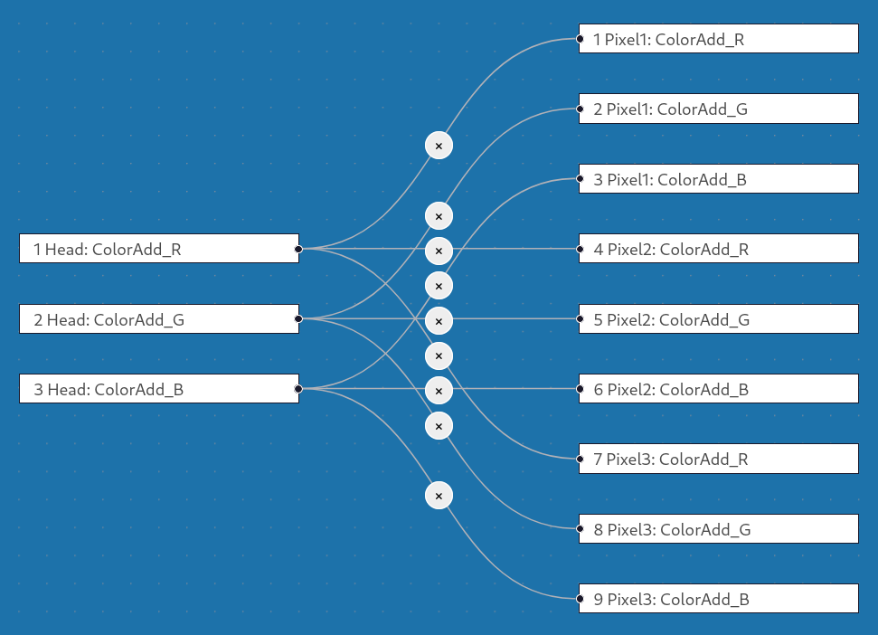

# gDetour

sACN DMX Channel Remapper utilizing [GDTF](https://gdtf-share.com/) device
definitions with a node based graphical user interface.



## Features

- Uses  [pygdtf](https://pypi.org/project/pygdtf/) to read from GDTF: DMX
  Modes, Channels, Defaults, Geometries, Attributes
- Visual grapical user interface with settings, nodes and connections
- Automap Input-Output channels with the same geometry-attribute pair
- Quick select free Output channels with the same attribute
- Quick connect one Input with many Output channels
- Save/Load channel mappings
- Receive sACN on one universe and Send sACN on another universe
- Display live Received/Sent DMX values

## FAQ

### What is this

gDetour is a tool to test DMX modes on real devices via channel remapping. Use
a small DMX mode on the console and test it on a full/larger DMX mode of a real
fixture. This can be done even if the smaller DMX mode does exist in the real
device. The device DMX channels are taken from their GDTF definitions.

### What this is not

At the moment, gDetour is not a production ready, generic DMX channel
re-mapping tool. There is a plan to add support for multiple fixtures in the
future. [PRs](https://github.com/vanous/gDetour/pulls) welcome.

### What is GDTF?

The General Device Type Format (GDTF) is an open standard for describing
devices of the entertainment industry. See documentation and further details on
[GDTF Hub](https://gdtf.eu/).

### Is the GDT [dʒiː diː tiː] sound in gDetour [dʒiː diː tuʁ] intentionally similar to GDTF [dʒiː diː tiː ɛf]?

You bet.

## Usage

- ### Settings

    - **Device Settings**
        - Upload GDTF files via "Show Extras - Upload GDTF Files"
        - Select Input fixture, Select a DMX mode (typically with a smaller DMX
          footprint),
        - Select Output fixture, Select a DMX mode (typically with a
          larger/full DMX footprint)
    - **sACN Settings**
        - Use the `Show Extra Features` to set Input and Output sACN Universe
        - Use the `See live DMX data` to see DMX values of the Input (received
          from DMX console) and Output (sent to the device)


- ### Mapping

    - Create mapping between Input and Output:
        - Press "Auto Mapping" for mapping to be created between input/output
          channels with the same geometry-attribute
        - Use the nodes panel, drag and drop connections between input-output
          channels

- ### Special Mapping Features

    - Select one Output channel, then click "Select Outputs with the same
      attribute" to select all unconnected Output channels with the same
      attribute
    - With several Output channels selected, Control-Shift click one Input
      channel, then click "Connect one to many". This will connect the single
      selected Input channel with all the currently selected Output channels.

- ### Fixture Testing

    - Once ready, use gDetour with a DMX console and with a real fixture:
        - **DMX console patching**
            - On DMX address 1 patch a single device.
            - The device and DMX mode are to be the same as the Input device in
              gDetour.
            - The sACN Universe is to be the same as the Input universe in
              gDetour.
        - **Real fixture settings**
            - Use a real fixture, same as the device in the Output device in
              gDetour.
            - Set it to sACN, DMX address 1, universe to be the same as the
              Output universe in gDetour.

## Requirements

Install `uv` on your system. `uv` will manage python and dependencies
installation and will also run the application.

- [uv](https://docs.astral.sh/uv/)

## Installation

Clone the [repository](https://github.com/vanous/gDetour/) or [download
it](https://github.com/vanous/gDetour/archive/refs/heads/master.zip) and uzip.

## Run the application

Inside the downloaded/unzipped repository, run:

```bash
uv run run.py
```

It will open up the application interface in a webbrowser window.

## Development

### Requires

- npm
- uv

### Install requirements

#### Back end (flask)

```bash
uv sync
```

#### Front end (svelte)

```bash
cd frontend`
npm i
```

### Run just the frontend svelte app

```bash
cd frontend
npm run dev -- --open
```

## Contributions

- Format Python code with [ruff](https://docs.astral.sh/ruff/)
- Format Svelte code with
  [prettier-plugin-svelte](https://www.npmjs.com/package/prettier-plugin-svelte)
- Add/update code license headers with
  [hawkeye](https://github.com/korandoru/hawkeye)
    - `hawkeye format`

## Dependencies

- [pygdtf](https://github.com/open-stage/python-gdtf)
- [Svelte Flow](https://svelteflow.dev/)
- [sACN for Python](https://github.com/Hundemeier/sacn)
- [Flask](https://flask.palletsprojects.com/en/stable/)
- [Svelte](https://svelte.dev/)
- [uv](https://docs.astral.sh/uv/)
- [python websockets](https://github.com/python-websockets/websockets/)
- [ifaddr](https://github.com/ifaddr/ifaddr)
